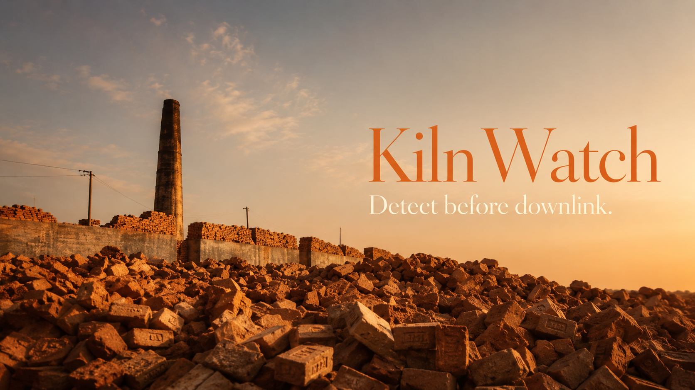
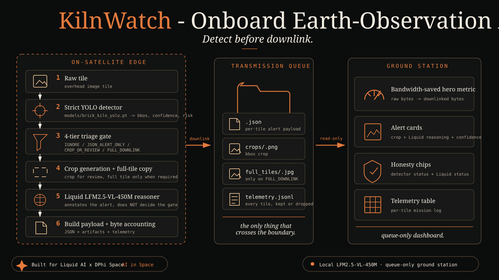
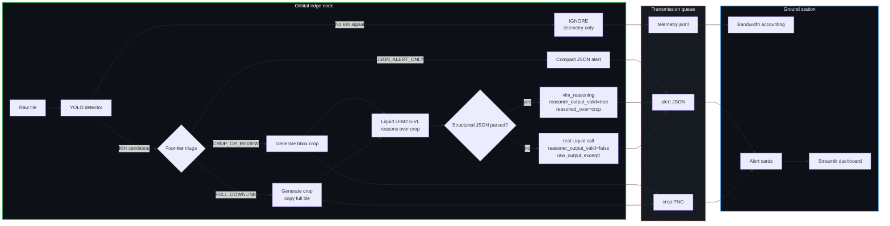
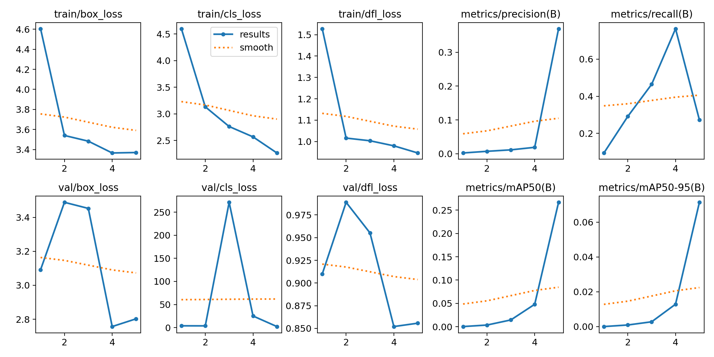
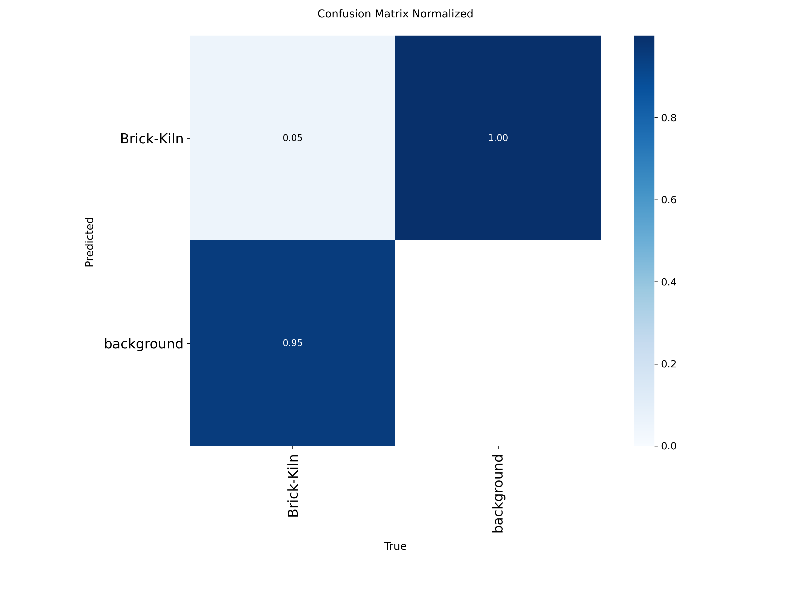
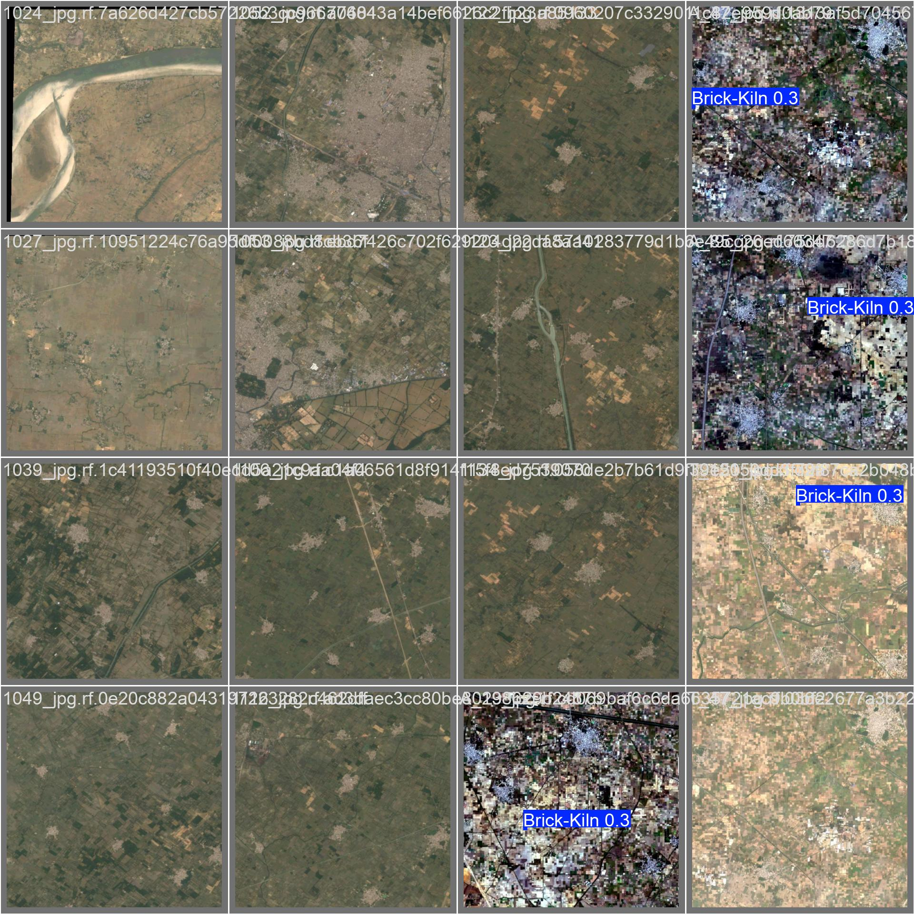

# KilnWatch

<p align="center">
  
</p>

<p align="center">
  <strong>Satellite-edge brick-kiln triage for the Liquid AI x DPhi Space AI in Space hackathon.</strong>
</p>

<p align="center">
  
  
  
  
  
</p>

<p align="center">
  <a href="https://klinwatchbrick.streamlit.app/"></a>
</p>

<p align="center">
  <strong>🌐 Live demo: <a href="https://klinwatchbrick.streamlit.app/">klinwatchbrick.streamlit.app</a></strong>
</p>

KilnWatch moves the first compliance decision into the orbital edge slot. A satellite-side node inspects incoming Earth-observation tiles, runs strict YOLO detection, creates crop evidence only for review-worthy detections, optionally asks Liquid LFM2.5-VL to reason over the generated crop, then downlinks compact JSON and crops instead of raw image streams.

The ground station only reads the downlinked queue. It does not open raw onboard image folders.

<p align="center">
  
</p>

## Highlights

- **Detect before downlink:** empty tiles are dropped onboard; only telemetry is kept.
- **Strict detector path:** YOLO mode requires `models/brick_kiln_yolo.pt` and `ultralytics`; missing real detector assets fail loudly.
- **Crop-first Liquid proof:** Liquid receives the generated `crop_path`, not the full tile, for crop reasoning.
- **Validity metadata:** every Liquid payload says whether the call was real, whether structured parsing succeeded, and what image was reasoned over.
- **Queue boundary:** Streamlit reads `transmission_queue/*.json`, `transmission_queue/telemetry.jsonl`, and `transmission_queue/crops/*` only.
- **Verified locally:** `python -m pytest -q` passes with 76 tests.

## Current Capabilities & Scope

KilnWatch is a local satellite-edge prototype focused on proving the downlink-triage architecture: detect before transmit, reason before review, and send evidence instead of empty fields.

### What the current demo supports

- Local satellite-edge triage flow.
- Strict YOLO detector path when `scripts/check_model_ready.py --json` passes.
- Real crop artifacts for review-tier detections.
- Liquid LFM2.5-VL local inference when `--reasoner liquid-local` succeeds.
- Structured crop reasoning when `reasoner_output_valid=true`.
- Four-tier transmission policy: `IGNORE`, `JSON_ALERT_ONLY`, `CROP_OR_REVIEW`, `FULL_DOWNLINK`.
- Queue-only ground station boundary.
- Byte accounting from actual generated files.

### Scope of this submission

This submission focuses on the architecture and local proof-of-concept run. It does not present KilnWatch as deployed satellite hardware, a production regulatory tool, or a Sentinel-validated accuracy benchmark. The current demo imagery is used to validate the pipeline mechanics; Sentinel/DPhi SimSat integration and Liquid fine-tuning are the next production steps.

## Why This Matters

Traditional geospatial compliance monitoring downlinks all imagery first, then runs detection on the ground. That wastes bandwidth on empty fields, roads, and non-actionable scenes.

KilnWatch is the missing front half of that pipeline: the satellite decides what is worth transmitting before the bandwidth is spent.

| Pipeline | Legacy downlink-first | KilnWatch orbital-edge |
|---|---:|---:|
| Raw tile handling | Downlink every tile | Inspect onboard first |
| Empty scenes | Still transmitted | Telemetry only |
| Alert scenes | Full image first, analysis later | JSON + targeted crop |
| Compute location | Ground server | Satellite-side edge node simulation |
| Ground station input | Raw imagery and analysis outputs | Downlinked artifacts only |

## How The AI Works



## Payload Proof

Structured crop reasoning is claimed only when these fields prove it:

```json
{
  "vlm_reasoning": {
    "reasoner_mode": "liquid-local",
    "model_name": "LiquidAI/LFM2.5-VL-450M",
    "reasoner_is_real": true,
    "reasoner_output_valid": true,
    "reasoned_over": "crop",
    "crop_path_used": "transmission_queue/crops/example_crop.png",
    "visual_summary": "...",
    "risk_reasoning": "...",
    "compliance_risk": "low|medium|high",
    "human_review_needed": true,
    "confidence_note": "..."
  }
}
```

If Liquid runs but returns unstructured text, the payload remains honest:

```json
{
  "reasoner_is_real": true,
  "reasoner_output_valid": false,
  "reasoned_over": "crop",
  "raw_output_excerpt": "..."
}
```

The dashboard renders that as: **Liquid call succeeded, structured parse failed.**

## Real Demo First

The actual judge-facing demo is the local Streamlit ground station:

```bash
streamlit run app.py
```

It reads only `transmission_queue/`. The Vercel/static website is a replay surface; the repo runs the inference.

### Local Test Suite

```bash
PATH=/home/dux/Work/tries/SpaceAI/.venv/bin:$PATH python -m pytest -q
```

Result:

```text
74 passed, 4 subtests passed
```

### Strict YOLO Readiness

```bash
python scripts/check_model_ready.py --json
```

Current checked result:

```json
{
  "ready_for_strict_yolo": true,
  "status": "real detector available",
  "class_names": ["Brick-Kiln"],
  "weights_exist": true,
  "ultralytics_available": true,
  "model_loads": true
}
```

### Real Liquid Local Probe

Strict YOLO plus the local Liquid model was probed against the final demo tiles:

```bash
python -m satellite_edge_node.orbital_pass \
  --raw-tiles data/final_demo_tiles \
  --transmission-queue /tmp/kilnwatch-liquid-local-probe \
  --detector yolo \
  --reasoner liquid-local \
  --require-crops --reset-queue
```

Observed output:

| Metric | Value |
|---|---:|
| Tiles processed | 14 |
| Alert payloads | 5 |
| Original bytes | 1,108,441 |
| Transmitted bytes | 11,745 |
| Bandwidth saved | 1,096,696 bytes |
| Compression ratio | 94.38x |
| Payload proof | all 5 alerts had `reasoned_over="crop"` and `crop_path_used`; 1 parsed as valid structured JSON and 4 were real Liquid calls with structured parse failure |

This is the intended honesty behavior: a real Liquid call is marked real, but it is not called structured reasoning unless `reasoner_output_valid=true`.

## YOLO Training Snapshot

The detector artifacts under `runs/detect/runs/brick_kiln_custom/` are local YOLO training outputs. The README uses copied snapshots so the public repo can show evidence without tracking the entire `runs/` directory.

Final logged epoch from `results.csv`:

| Precision | Recall | mAP50 | mAP50-95 |
|---:|---:|---:|---:|
| 0.3696 | 0.2724 | 0.2667 | 0.0714 |

This is prototype detector evidence, not a production compliance-accuracy claim.

<p align="center">
  
  
</p>

<p align="center">
  
</p>

## Quickstart

```bash
python -m venv .venv
source .venv/bin/activate
pip install -r requirements.txt
pip install ultralytics transformers
```

Check the real detector:

```bash
python scripts/check_model_ready.py --json
```

Strict YOLO mode expects local weights at `models/brick_kiln_yolo.pt`. The repository keeps large model binaries out of git; if that file is missing, add the weights there before using `--detector yolo`.

Run the full local Liquid proof path:

```bash
python -m satellite_edge_node.orbital_pass \
  --raw-tiles data/final_demo_tiles \
  --transmission-queue transmission_queue \
  --detector yolo \
  --reasoner liquid-local \
  --require-crops --reset-queue
```

Run the reliable YOLO-only fallback if the local Liquid model cache is unavailable:

```bash
python -m satellite_edge_node.orbital_pass \
  --raw-tiles data/final_demo_tiles \
  --transmission-queue transmission_queue \
  --detector yolo \
  --reasoner disabled \
  --require-crops --reset-queue
```

Start the ground station:

```bash
streamlit run app.py
```

## Web Interface

> 🌐 **Hosted demo:** [klinwatchbrick.streamlit.app](https://klinwatchbrick.streamlit.app/) — live Streamlit Cloud deployment, same dashboard, same real Liquid LFM2.5-VL output that you can run locally.

The Streamlit dashboard is the judge-facing ground station.

It shows:

- bandwidth saved from telemetry
- strict YOLO / fallback / baseline status
- Liquid structured / parse-failed / mock / disabled status
- alert cards with crop evidence
- raw payload and telemetry JSON for inspection

It intentionally does **not** read raw onboard imagery.

## Repository Map

```text
app.py                         Streamlit ground-station dashboard
satellite_edge_node/
  orbital_pass.py              detect -> triage -> crop -> reason -> queue
  yolo_detector.py             strict Ultralytics YOLO integration
  liquid_vlm_reasoner.py       Liquid LFM2.5-VL crop reasoner
  payloads.py                  crop generation, payload JSON, byte accounting
kilnwatch/
  ground_station.py            queue-only loading and proof summaries
  triage.py                    four-tier transmission decision model
scripts/
  check_model_ready.py         strict YOLO readiness check
  evaluate_detector.py         telemetry/manifest comparison helper
tests/                         regression and boundary tests
readmeimages/                  public README images
transmission_queue/            generated demo queue artifacts
```

## Technical Honesty

Safe claims:

- local satellite-edge triage architecture
- strict YOLO path when readiness check passes
- generated crop artifacts for review tiers
- Liquid LFM2.5-VL local inference when `--reasoner liquid-local` succeeds
- structured crop reasoning only when `reasoner_output_valid=true`
- queue-only ground station boundary
- byte accounting from actual files

Not claimed:

- deployed satellite hardware
- Sentinel-domain detection accuracy
- Liquid fine-tuning
- production-grade regulatory compliance
- Roboflow fixture imagery as live DPhi/Sentinel provenance
- mock or fallback output as real model inference

## References

- Liquid AI x DPhi Space, AI in Space Hackathon
- LiquidAI/LFM2.5-VL-450M
- Ultralytics YOLO
- DPhi-Space SimSat
- SentinelKilnDB and APAD-style brick kiln datasets
